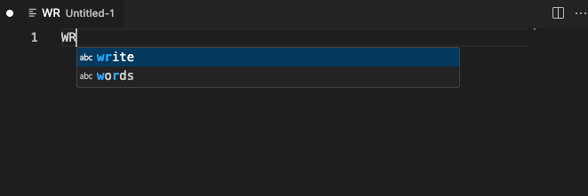

# Support

If you like the "CApitalization Correction" extension please consider supporting it.

&nbsp;&nbsp;

# Capitalization Correction

This extension does only one thing: it corrects a typo in the capitalization.
If you type in 2 uppercase characters followed by a lower case character it will change the change the second character to lower case.
For example: If you type in "THe" it will be changed to "The".

